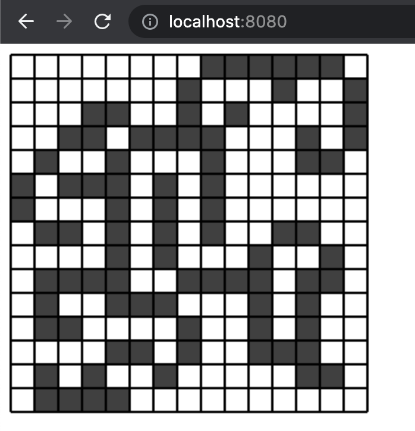

# Rust Wasm Game of Life

This repo contains an example implementation of [Conway's Game of Life](https://en.wikipedia.org/wiki/Conway%27s_Game_of_Life) in Rust and WebAssembly.

## How to use

You should have [wasm-pack](https://github.com/rustwasm/wasm-pack) installed.
```sh
cargo install wasm-pack
wasm-pack build
cd www
npm start
```



## Credits

Many thanks to the creators of [wasm-pack-template](https://github.com/rustwasm/wasm-pack-template)
